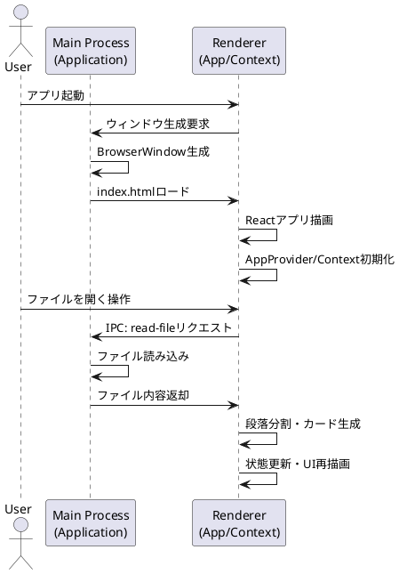

# アーキテクチャ概要

このアプリはElectronを用いたデスクトップアプリケーションであり、主に以下の2つのプロセスで構成されています。

- **Mainプロセス**（`src/main/main.ts`）：ウィンドウ生成、メニュー、IPC通信、ファイル操作
- **Rendererプロセス**（`src/renderer/index.tsx` 〜 Reactコンポーネント群）：UI描画、状態管理、ユーザー操作

---

## 起動時の全体フロー

1. **Electronアプリ起動**
    - Mainプロセスで`Application`クラスがインスタンス化される。
    - ウィンドウ生成・メニュー設定・IPCハンドラ登録が行われる。

2. **ウィンドウ表示**
    - 開発時は`localhost:3000`、本番時は`renderer/index.html`をロード。

3. **Rendererプロセス起動**
    - `index.tsx`でReactアプリ（`App`コンポーネント）が描画される。

4. **AppProviderによる状態管理**
    - `AppContext`でアプリ全体の状態・イベント管理を行う。

5. **ファイル読み込み操作**
    - ユーザーがファイルを開くと、IPC経由でMainプロセスにリクエスト。
    - Mainプロセスがファイル内容を返却し、Renderer側で段落分割・カード生成。

---

## PlantUMLシーケンス図

---

## 詳細説明

- **Mainプロセス**
    - Electronのライフサイクル管理、ウィンドウ生成、メニュー操作、ファイルダイアログやファイル読み書きなどを担当。
    - RendererからのIPCリクエスト（ファイル読み込み・保存等）を受けて処理し、結果を返却。

- **Rendererプロセス**
    - ReactによるUI描画と状態管理。
    - AppContextでアプリ全体の状態（カードリスト、選択、フィルタ、ログ等）を管理。
    - ファイル読み込み時は、MainプロセスにIPCでリクエストし、取得した内容を段落ごとにカード化して表示。

- **状態管理・履歴**
    - Undo/Redoやログ管理もAppContextで一元管理。

---
